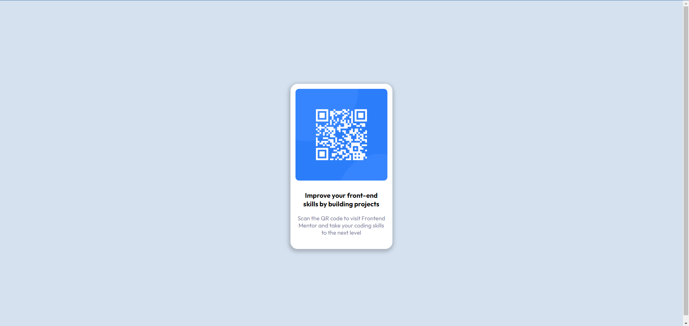

# Frontend Mentor - QR code component solution

This is a solution to the [QR code component challenge on Frontend Mentor](https://www.frontendmentor.io/challenges/qr-code-component-iux_sIO_H). Frontend Mentor challenges help you improve your coding skills by building realistic projects. 

## Table of contents

- [Overview](#overview)
  - [Screenshot](#screenshot)
  - [Links](#links)
- [My process](#my-process)
  - [Built with](#built-with)
  - [What I learned](#what-i-learned)
- [Author](#author)

### Screenshot

### Links

- Solution URL: (https://github.com/barka-dev/qr-code-component.git)
- Live Site URL: (https://barka-dev.github.io/qr-code-component/)

### Built with

- Semantic HTML5 markup
- CSS custom properties
- Flexbox

### What I learned
I learned how to use Github and how to deploy a website on Github

## Author

- Website - [Abdessalam Barka](https://www.your-site.com)
- Frontend Mentor - [@barka-dev](https://www.frontendmentor.io/profile/barka-dev)
- Twitter - [@AbdessalamBarka](https://www.twitter.com/yourusername)

